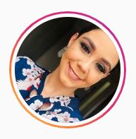

# Desafio Cadastro Pessoal - Formação Tech - Edição 4 # 

[LINKEDIN](https://linkedin.com/in/karla-cracco-5994b7220) 

- [Desafio Cadastro Pessoal - Formação Tech - Edição 4 #](#desafio-cadastro-pessoal---formação-tech---edição-4-)
  - [Autor](#autor)
  - [Descrição](#descrição)
  - [Objetivo](#objetivo)
  - [Linguagens](#linguagens)
  - [Ferramentas](#ferramentas)

## Autor

* **Nome:** Karla Rojas Cracco Lima Império Dalmati
* **Idade:** 29 anos
* **Tipo de deficiência:** Deficiente auditiva; usa a Libras (Língua Brasileira de Sinais) 

## Descrição

Nasci surda devido a doença da rubeóla herdada por minha mãe ainda na gravidez. Aprendi Libras ainda criança e isso me ajudou obter acesso a informação nos seus mais variados segmentos. Sempre gostei de maquiagem e me formei no Senac como maquiadora profissional. Atualmente trabalho como Instrutora de Libras ministrando cursos de Libras na forma online.

Sempre tive interesse em aprender coisas novas, e recentemente meu marido me incentivou a aprender programação devido as oportunidades que estão surgindo na área. Isso me tocou profundamente pois, apesar da minha deficiência, percebi que tenho agora a oportunidade de fazer mais, coisas maiores na minha carreira profissional. Quando pude entender claramente isso, me apaixonei a primeira vista em programação. Apesar dos desafios, tenho certeza que irei superá-los e me tornar uma excelente programadora!!

## Objetivo

Desenvolver um Formulário de Cadastro com alguns campos obrigatórios e algumas validações.

## Linguagens

* HTML
* CSS
* JavaScript

## Ferramentas

Visual Studio Code, com Git Bash e GitHub Desktop no Windows 10. 
                          

 

